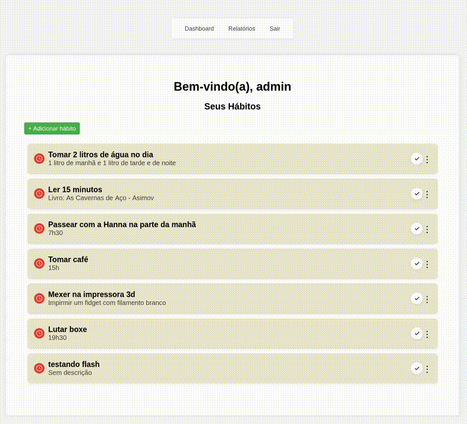

# Habit Tracker


Plataforma de Controle de Hábitos e Produtividade 📊  
Este projeto tem como objetivo ajudar usuários a criarem e monitorarem hábitos, registrar o progresso diário e visualizar relatórios com gráficos e análises simples.  

<p align="center">
  
</p>

---

## 🚀 Tecnologias utilizadas
- **Python 3**  
- **Flask** (backend)  
- **SQLite** (banco de dados inicial)  
- **HTML, CSS, JavaScript** (frontend)  
- **Pandas + Matplotlib/Plotly** (análise e visualização de dados)  

---

## 🎯 Objetivos do projeto
- Aprender e aplicar conceitos de **desenvolvimento web**.  
- Praticar **banco de dados relacional**.  
- Explorar fundamentos de **ciência de dados**.  
- Desenvolver como se fosse um projeto real de empresa (sprints, tarefas, versionamento).  

---

## ⚙️ Funcionalidades

- Autenticação de usuários.
- Sistema de hash de senhas (segurança aprimorada).
- Exibição de mensagens flash (feedback visual para o usuário).
- Gerenciamento de hábitos com título e descrição.
- Interface HTML com herança de templates (`base.html`).

---

## 💬 Mensagens Flash

O projeto implementa mensagens flash do Flask para exibir alertas e notificações (ex: login bem-sucedido, erro de validação, etc.).
Cada categoria (`success`, `error`, `info`) possui estilo visual próprio no CSS.

---

## 🔄 Blueprints no Flask

Os Blueprints são uma forma de organizar o código em aplicações Flask, permitindo dividir o projeto em módulos menores e mais fáceis de manter.
Com eles, é possível separar rotas, funções e templates por área do sistema, como autenticação e hábitos, facilitando o desenvolvimento, 
a leitura e a escalabilidade do código.

Exemplo:

``` python
   
   # routes/auth.py
   auth_bp = Blueprint('auth', __name__) # Cria um módulo de rotas chamado 'auth' e atribui a auth_bp.
   
   @auth_bp.route('/logout', methods=['GET'] )
   def logout_user():
     session.pop('id_user', None)
     flash('Logout feito! Já estamos com saudades. ;)', 'success')
     return redirect(url_for('auth.login_user'))

   # app.py 
   from routes import auth_bp

   app.register_blueprint(auth_bp) # Registra as rotas atribuídas ao auth_bp
```
---

## 🔐 Segurança

O sistema agora utiliza **hash de senhas** com `werkzeug.security` para garantir a proteção dos dados de login.
Nenhuma senha é armazenada em texto puro no banco de dados.

---

## 📈 Estatísticas

Na aba relatório do sistema se encontra as estatísticas dos hábitos por periódo definidos, como, os últimos 7, 15 ou 30 dias,
no qual, é possóvel visualizar a taxa de conclusão dos hábitos no periódo escolhido, além de mostrar a quantidade de hábitos totais,
e a taxa de conclusão de hábitos por dia da semana.

## 📂 Estrutura atual do projeto
```bash
habit-tracker/
├── app.py
├── database.py
├── requirements.txt
├── .gitignore
├── routes/
│   ├── __init.py__
│   ├── auth.py
│   └── habits.py         
├── static/
│   ├── css/
│   │   ├── global.css
│   │   ├── register.css
│   │   ├── add_habit.css
│   │   ├── login.css
│   │   ├── edit_habit.css
│   │   ├── reports.css
│   │   └── dashboard.css
│   └── js/
│       └── reports.js
├── templates/
│   ├── base.html
│   ├── login.html
│   ├── edit_habit.html
│   ├── register.html
│   ├── dashboard.html
│   ├── reports.html
│   └── add_habit.html
└── habit-tracker.db  (ignorado no git)
```

---

## 🏗 Status das Sprints

- **Sprint 1:** 
- **Sprint 2:** 
- **Sprint 3:** 
- **Sprint 4:** 
- **Sprint 5:** 
- **Sprint 6:** 

---

## 🧩 Sprint 4 — Melhorias Técnicas

- Implementação de hash de senhas com `werkzeug.security`.
- Sistema de mensagens flash com suporte a categorias.
- Criação do arquivo `requirements.txt`.
- Refatoração da estrutura de templates (uso de `base.html`).

 ## 🧩 Sprint 5 — CRUD Completo e Refatoração Modular

 - Implementação de edição e exclusão os hábitos cadastrados
 - Implementação do diretório `routes/`
 - Criação do arquivo `auth.py` para armazenar as rotas de autenticação
 - Criação do arquivo `habits.py` para armazenar as rotas CRUD
 - Refatoração das funções que fazem consultas no banco de dados em uma única função genérica (`database.py`)
 - Implementação de Blueprints para registrar as rotas que estão em módulos (`routes\`) 


 ## 🧩 Sprint 6 — Relatórios e Visualização

 - Implementação de relatórios
 - Melhorias na visualização e responsividade
 - Criação de logs diários 


## 📦 Dependências

As bibliotecas necessárias estão listadas no arquivo `requirements.txt`.

Para instalar todas de uma vez:
```bash
   pip install -r requirements.txt
```

---

📝 Como rodar localmente

1. Clone este repositório:
   ```bash
      git clone https://github.com/orafaeldantas/habit-tracker.git
      cd habit-tracker
   ```

3. Crie e ative um ambiente virtual:

   ```bash
      python -m venv venv 
      source venv/bin/activate    # Linux/Mac
      venv\Scripts\activate       # Windows
   ```

3. Instale dependências:

   ```bash
      pip install -r requirements.txt
   ```

4. Execute a aplicação:

   ```bash
      python app.py
   ```

5. Acesse no navegador:

   http://127.0.0.1:5000/

---

👨‍💻 **Autor**

Desenvolvido por [Rafael Dantas](https://github.com/orafaeldantas) — projeto de portfólio para prática de desenvolvimento web, banco de dados e ciência de dados.


   


